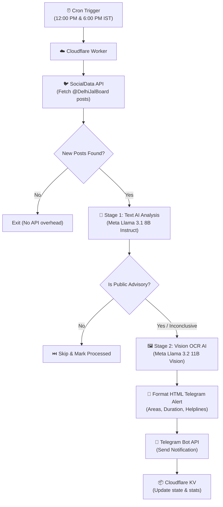

# 🚰 Delhi Jal Board Twitter Advisory Telegram Bot

[](https://workers.cloudflare.com/)
[](https://developers.cloudflare.com/workers-ai/)
[](https://core.telegram.org/bots/api)
[](https://ai.meta.com/llama/)
[](LICENSE)

An automated, serverless notification system hosted on **Cloudflare Workers**. It monitors Delhi Jal Board's official X/Twitter handle ([`@DelhiJalBoard`](https://x.com/DelhiJalBoard)), analyzes posts and official poster images using **Cloudflare Workers AI** (Meta Llama 3.1 Text + Meta Llama 3.2 Vision OCR), and broadcasts structured public water advisories directly to a **Telegram Bot**.

---

## 📐 Architecture Overview



---

## ✨ Key Features

- **⚡ Zero Server Cost ($0/month)**: Operates 100% within the free tiers of Cloudflare Workers, Cloudflare Workers AI, SocialData API, and Telegram.
- **🧠 Two-Stage AI Analysis Pipeline**:
  - **Stage 1 (Text Classification)**: Uses `@cf/meta/llama-3.1-8b-instruct-fast` to evaluate tweet text and filter out non-advisory posts (promotional content, slogans, event announcements).
  - **Stage 2 (Vision Poster OCR)**: Uses `@cf/meta/llama-3.2-11b-vision-instruct` to scan official DJB notice infographics and extract structured data: affected localities, maintenance timings, and emergency helpline numbers.
- **⏰ Smart Scheduling**: Triggered twice daily at **12:00 PM IST (06:30 UTC)** and **6:00 PM IST (12:30 UTC)** using Cloudflare Cron Triggers, aligned with DJB's typical announcement windows.
- **📦 State Management & Deduplication**: Employs Cloudflare KV (`TWEET_STORE`) to track processed tweet IDs and maintain deduplication logs with 7-day TTL expiration.
- **🛠️ Self-Healing Error Handling**: Automatic model failovers, keyword heuristics fallbacks, and exponential backoff retry logic for API rate limits.

---

## 📱 Telegram Alert Preview

When a public advisory is detected, the bot delivers a formatted HTML message:

```html
🚰 DELHI JAL BOARD ADVISORY
━━━━━━━━━━━━━━━━━━━━

📋 Category: Water Supply Disruption
📅 Date: 22 Jul 2026, 08:30 PM IST

📝 Summary:
Water supply from Sonia Vihar WTP will be affected due to major
maintenance on South Delhi Main. No supply on 22 Jul evening, low pressure on 23 Jul morning.

📍 Affected Areas:
Kailash Nagar, Gandhi Nagar, Okhla, Zakir Nagar, Kaka Nagar,
Jor Bagh, Kalkaji, Jasola, Sarita Vihar, GK South...

⏰ Duration: 8 hours starting 10:00 AM on 22/07/2026

📞 Emergency Helpline: 1916 (Water Emergency), 26193218 (R.K. Puram)

💬 Original Post:
"Due to essential maintenance work on the South Delhi Main, water supply..."

🔗 View Post on X/Twitter
```

---

## 🛠️ Project Structure

```
djb-telegram-bot/
├── src/
│   ├── index.js          # Worker entrypoint (Cron handler + HTTP endpoints)
│   ├── twitter.js        # Twitter client using SocialData API
│   ├── analyzer.js       # Cloudflare Workers AI (Llama 3.1 & Llama 3.2 Vision)
│   ├── telegram.js       # Telegram Bot API client with retry & HTML support
│   └── formatter.js      # HTML message formatter with entity escaping
├── wrangler.toml         # Cloudflare Worker configuration & bindings
├── package.json          # Node dependencies & scripts
├── .gitignore            # Security exclusions (.dev.vars, node_modules)
└── README.md             # Complete project documentation
```

---

## 🚀 Step-by-Step Installation & Deployment

### Prerequisites

- [Node.js](https://nodejs.org/) (v18 or higher)
- A free [Cloudflare Account](https://dash.cloudflare.com/)
- A Telegram Bot token from [@BotFather](https://t.me/BotFather)
- An API Key from [SocialData.tools](https://socialdata.tools)

### Step 1: Clone the Repository

```bash
git clone https://github.com/ChainiKhaini/djb-telegram-bot.git
cd djb-telegram-bot
npm install
```

### Step 2: Create Cloudflare KV Namespace

Run Wrangler CLI to create the state storage namespace:

```bash
npx wrangler kv namespace create TWEET_STORE
```

Copy the returned namespace `id` and update [`wrangler.toml`](file:///C:/Users/Geon/.gemini/antigravity/scratch/djb-telegram-bot/wrangler.toml):

```toml
[[kv_namespaces]]
binding = "TWEET_STORE"
id = "YOUR_KV_NAMESPACE_ID"
```

### Step 3: Configure Cloudflare Secrets

Store your sensitive API keys securely in Cloudflare's encrypted vault:

```bash
# 1. SocialData API Key
npx wrangler secret put SOCIALDATA_API_KEY

# 2. Telegram Bot Token (from @BotFather)
npx wrangler secret put TELEGRAM_BOT_TOKEN

# 3. Telegram Chat ID (Your user ID or channel handle)
npx wrangler secret put TELEGRAM_CHAT_ID
```

### Step 4: Local Development & Testing

1. Create a `.dev.vars` file for local secrets:
   ```ini
   SOCIALDATA_API_KEY="your_api_key_here"
   TELEGRAM_BOT_TOKEN="your_bot_token_here"
   TELEGRAM_CHAT_ID="your_chat_id_here"
   ```
2. Start the local development server:
   ```bash
   npm run dev
   ```

### Step 5: Deploy to Production

Deploy the Worker live to Cloudflare edge network:

```bash
npm run deploy
```

Wrangler will output your deployed Worker URL: `https://djb-telegram-bot.<your-subdomain>.workers.dev`

---

## 📊 Monitoring & REST Endpoints

The worker exposes HTTP management endpoints:

| Endpoint | Method | Description |
|----------|--------|-------------|
| `/health` | `GET` | System health check, status, uptime, and last checked tweet ID |
| `/stats` | `GET` | Metrics dashboard (total tweets checked, advisories sent, run counts) |
| `/trigger` | `POST` | Manually triggers the AI pipeline on-demand without waiting for scheduled cron |

#### Example Usage:
```bash
# Check health
curl https://djb-telegram-bot.<your-subdomain>.workers.dev/health

# Trigger manual check
curl -X POST https://djb-telegram-bot.<your-subdomain>.workers.dev/trigger
```

---

## 💡 Resource & Cost Analysis

| Service | Free Plan Limit | Project Usage | Monthly Cost |
|---------|-----------------|---------------|--------------|
| **Cloudflare Workers** | 100,000 req/day | ~12 requests/day | **$0.00** |
| **Cloudflare Workers AI** | 10,000 neurons/day | ~350 neurons/day | **$0.00** |
| **Cloudflare KV** | 100,000 reads/day | ~6 reads/day | **$0.00** |
| **SocialData API** | 3 req/min free | ~60 requests/month | **$0.00** |
| **Telegram Bot API** | Unlimited | ~5–10 msgs/day | **$0.00** |
| **Total Cost** | | | **$0.00 / month** |

---

## 📄 License

This project is licensed under the [MIT License](LICENSE).

---

<p align="center">
  Made with ❤️ for Delhi Residents • Powered by Cloudflare Workers AI & Llama 3.2
</p>
